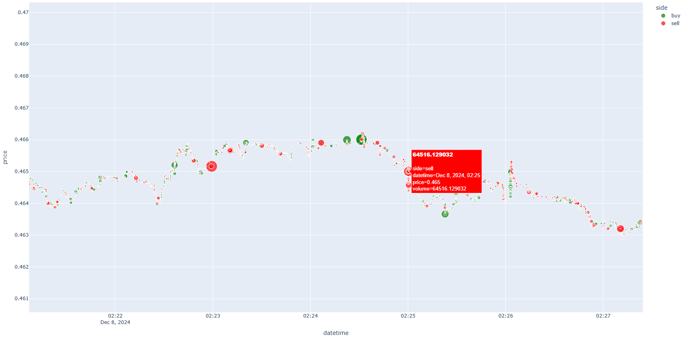

# vnpy demo

主要用于熟悉vnpy的各个组件实际使用功能呢。

## usage
1. 安装依赖
```
pip install -r requestments.txt
```
注意: ta-lib 可能安装失败，可使用 conda install -c conda-forge ta-lib

2. 设置环境python环境库的环境变量

```
export PYTHONPATH=$(this project path)
```

3. 获取OKX的api key(自行在okx上申请)。只是下载K线与历史交易数据，无需申请。

```
export OKX_API_KEY=xxxxxxxxx
export OKX_SECRET_KEY=xxxxxxxxxx
export OKX_PASSPHRASE=xxxxx
```

## download history data


1. 历史k线数据下载: 
将ccxt 提供的fetch_ohlcv接口集成到okxgateway中，可以下载数据。
但是由于okx的接口， 限制成100条/请求，增加分片下载的机制，借此实现下载任意年份的K线数据。可以存储在sqlite数据库中。

2. 历史交易数据下载:
此外，针对高频场景，额外实现了对接okx的历史交易数据的接口，可以实现下载最近三个月的历史交易数据，同样保存在sqlite数据库中。

## draw analysis

1. 实现绘制历史交易的图表。
